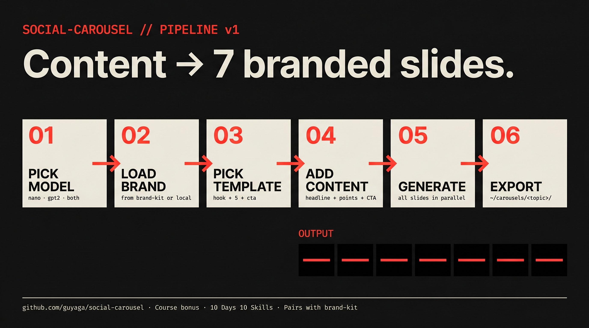

# social-carousel

A Claude Code skill that generates branded multi-slide social media carousels using AI image generation.

> Course bonus for the **10 Days, 10 Skills** AI course by [Guy Aga](https://bestguy.ai).



## What it does

One command → 7 on-brand carousel slides (Instagram, LinkedIn, X, Facebook).

- **Pick your model** — `nano-banano-pro` (Gemini 3 Pro Image), `gpt-image-2` (OpenAI), or both for comparison.
- **Brand-aware** — auto-loads colors, fonts, logo, and person photo from your active [`brand-kit`](https://github.com/guyaga/brand-kit) if installed; falls back to local cache or inline interview.
- **Coherent across slides** — same palette, typography, logo placement, and visual style locked across the whole carousel.
- **Numbered output** — saves to `~/carousels/<topic>-<date>/slide-NN.png` plus a manifest.

## Install

**Windows (PowerShell):**
```powershell
iwr https://raw.githubusercontent.com/guyaga/social-carousel/main/install.ps1 | iex
```

**Mac / Linux:**
```bash
curl -fsSL https://raw.githubusercontent.com/guyaga/social-carousel/main/install.sh | bash
```

**Manual:**
```bash
git clone https://github.com/guyaga/social-carousel ~/.claude/skills/social-carousel
cd ~/.claude/skills/social-carousel
npm install
node setup.mjs
```

## Setup — API keys

Set at least one:

```bash
# Mac / Linux
export GEMINI_API_KEY=...      # → nano-banano-pro
export OPENAI_API_KEY=sk-...   # → gpt-image-2

# Windows PowerShell
$env:GEMINI_API_KEY="..."
$env:OPENAI_API_KEY="sk-..."
```

If you only set one, the skill defaults to that model.

## Generate a carousel

```bash
node ~/.claude/skills/social-carousel/cli.mjs
```

You'll be asked:

1. **Model** — `nano` / `gpt2` / `both`
2. **Brand** — auto-loads from `brand-kit` if installed; otherwise asks once and caches locally.
3. **Content** — hook headline, 5 list items (each title + body), CTA copy.

Then 7 slides fire in parallel. Done in under 2 minutes.

## Output structure

```
~/carousels/<topic>-2026-05-04/
├── slide-01.png       ← hook slide
├── slide-02.png       ← point 1
├── slide-03.png       ← point 2
├── slide-04.png       ← point 3
├── slide-05.png       ← point 4
├── slide-06.png       ← point 5
├── slide-07.png       ← CTA slide
└── carousel.json      ← prompts + brand snapshot used (for re-runs)
```

If you picked `both`, slides are tagged: `slide-01-nano.png`, `slide-01-gpt2.png`, etc.

## Brand source — fallback chain

The skill looks for brand info in this order:

1. **`brand-kit`** — `~/.claude/brand-kits/active.txt` (if `brand-kit` is installed and a brand is active)
2. **Local cache** — `~/.claude/skills/social-carousel/brand.json` (saved on first inline run)
3. **Inline interview** — asks you for colors/fonts/voice once, then caches locally

You don't have to install `brand-kit` to use `social-carousel`. But if you have it, every skill stays in sync.

## Coherence rules (locked across all slides)

- Same brand palette — no per-slide color drift
- Same `visual_style.description` injected into every prompt
- Same logo placement (bottom-right when a logo asset is present)
- Same person identity description (when a person photo is part of the brand)
- Same aspect ratio (1:1 default)

## Pairs with

- [`brand-kit`](https://github.com/guyaga/brand-kit) — the brand source-of-truth this skill consumes.

## License

MIT.

---

Built for the [10 Days, 10 Skills](https://bestguy.ai/thebigbomb) free AI course by Guy Aga.
